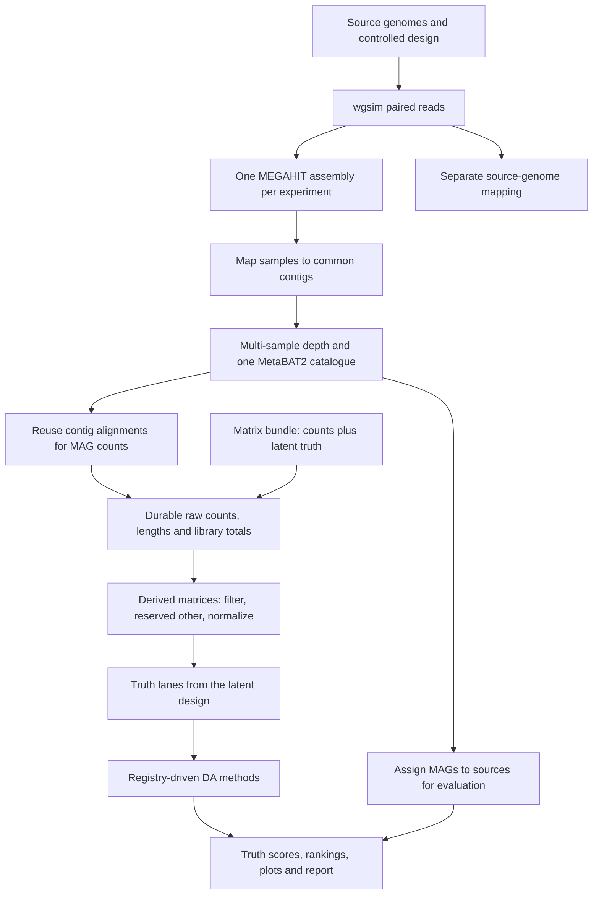

# MAGICIAN: differential abundance benchmarks on MAGs

MAGICIAN simulates controlled communities, reconstructs a shared MAG catalogue,
quantifies source genomes and MAGs separately, runs multiple differential abundance
methods, and scores discoveries against truth defined on the measurement scale each
method actually tests. It retains compact benchmark results and audit evidence;
sequencing intermediates are temporary.

The default is an artificial **software smoke test**: four genomes, six independent
samples, one null experiment and one spiked experiment. Use real genomes and repeated
independent seeds before interpreting method rankings.

## Workflow



Methods are declared once in [config/methods.yaml](config/methods.yaml) and run
through small adapters under `workflow/scripts/da/`. Count methods receive actual
counts. Compositional methods also compare TPM, RPKM and relative abundance. Missing
packages, empty catalogues and timeouts are explicit and cannot become winners.

## Setup and smoke run

```bash
conda env create -n magician --file environment.yaml
conda activate magician
python run_magician.py --dry-run
python run_magician.py --cores 4
```

Standard Snakemake commands also work:

```bash
export CONDA_PKGS_DIRS="$PWD/cache/packages"
export XDG_CACHE_HOME="$PWD/cache/xdg"
snakemake --snakefile workflow/Snakefile --cores 4 --dry-run
snakemake --snakefile workflow/Snakefile --cores 4
```

Snakemake reads profiles/default/config.yaml automatically. Executable rules have
pinned Conda environments, threads, memory/disk resources, logs and benchmarks.
Python module fingerprints, the R contract, the selected adapter and the method
registry are tracked dependencies: changing one reruns testing and scoring while
retaining expensive upstream results. First installation needs network access. The
SLURM profile under profiles/slurm requires its executor plugin plus your
account/partition settings.

Methods whose R packages are not distributed through conda are installed from pinned
CRAN tarballs, pinned Bioconductor release tarballs or pinned Git commits, before any
run. No DA rule touches the network:

```bash
python tools/bootstrap_envs.py --all            # build and freeze every method environment
python tools/bootstrap_envs.py --env r_aldex3   # or one at a time
```

Exact resolved builds, checksums and pinned sources are archived under
workflow/envs/locks; see its README.

Open **results_benchmark/benchmark/report.html** after completion.

The larger artificial pilot uses 20 genomes and 10 samples per group:

```bash
python run_magician.py --configfile config/pilot20.yaml --cores 8
```

Its report is `results_pilot20/benchmark/report.html`. The completed
[pilot record](docs/validation.md#twenty-genome-artificial-pilot) describes recovery,
discoveries and resources for the original seven methods. The
[extension plan](docs/extension_plan.md) covers the new methods, truth lanes and
repeated studies; the [status section](docs/extension_plan.md#implementation-status)
records what is implemented and validated.

| File | Meaning |
|---|---|
| benchmark/ranking.tsv | Eligibility and ranking by catalogue/input/endpoint |
| benchmark/scores.tsv | Per-run FDR, recall, average precision and confusion counts |
| benchmark/recovery.tsv | Recovered, ambiguous and multiply matched source genomes |
| benchmark/method_settings.tsv | Declared inputs, units, references, settings, citations |
| benchmark/method_resources.tsv | Measured runtime and RSS per method and input |
| benchmark/recommendations.json | Eligible candidate, or an explicit no-candidate result |
| benchmark/rule_resources.tsv | Measured per-rule runtime and memory |
| benchmark/storage.json | Retained output/cache sizes and resource summary |
| evaluation/CASE/feature_evaluation.tsv | Discoveries joined to source truth |
| truth/CASE/KIND.tsv | Every truth lane, with its denominator and availability |

Scores retain method messages, package versions and fitting time. Empty catalogues,
convergence failures, timeouts and unavailable packages appear as their own statuses.
Variants of one method family are reported as a single candidate.

## Matrix-only mode

New methods and matrix simulations never need reads, assembly or binning. A matrix
bundle is a versioned directory of cases, each supplying integer counts, feature
lengths, sample metadata, the latent expectations every truth lane is computed from,
and an identity source matching table:

```text
bundle/
  cases.tsv                     case, scenario, seed
  CASE/samples.tsv              sample_id, group, read_pairs
  CASE/features.tsv             feature_id, length_bp
  CASE/counts.tsv               feature_id and one column per sample
  CASE/truth.tsv                feature_id, is_da, true_log2fc, lengths
  CASE/expectations.tsv         latent per-sample proportions and counts
  CASE/matching.tsv             feature_id, source_id, match_status
```

```yaml
input_mode: matrix
matrix_input:
  bundle: config/my_bundle
```

The shared analysis path then runs unchanged: import, derive, truth lanes, methods,
scoring and report. Matrix screening replicates are generated directly from a latent
Dirichlet-multinomial model:

```bash
python tools/matrix_screening.py --designs baseline overdispersed low_count \
    --null-replicates 100 --spiked-replicates 30 --cores 8
```

## Real genomes and repeated experiments

Create a candidate list with genome_id, accession, version, path, provenance and
source_group, then freeze the selection you will actually run. Nothing is downloaded,
and an existing local reference collection is referenced by path rather than copied:

```bash
python tools/real_genomes.py check config/my_candidates.tsv
python tools/real_genomes.py freeze config/my_candidates.tsv \
    --out config/genome_manifest.tsv \
    --rule "longest genome per source group, then the predefined related subset" \
    --group diverse=20 --group related=5
```

The frozen manifest records accession and version, local path, checksum, length and
the selection rule, and is checked before any read is simulated. Create an overlay:

```yaml
genomes:
  manifest: config/genome_manifest.tsv
experiment:
  seeds: [42, 43, 44, 45, 46]
  samples_per_group: 10
  read_pairs: 500000
  differential_fraction: 0.15
storage:
  budget_gb: 100
```

```bash
python run_magician.py --configfile config/my_experiment.yaml --dry-run
python run_magician.py --configfile config/my_experiment.yaml --cores 4
```

Missing keys inherit config/config.yaml. config/production.yaml is a larger example.
Increase depth after a pilot recovers usable MAGs. Zero MAGs are a valid outcome, with
empty matrices and an explicit report. Rankings are specific to these simulations.

## Storage and organization

Default budget: 100 GB, configurable to 200 GB. Heavy case processing executes
sequentially; small DA fits can overlap it. Successful completion retains no FASTQ,
BAM, assembly or MAG FASTA. Compact matrices and evidence allow DA reruns. See
[storage policy](docs/storage.md) for cache accounting, resource estimation, runtime
guards and physical-cap limitations.

```text
config/                 Settings, method registry, zero policies, manifest examples
workflow/Snakefile      Workflow entry point
workflow/rules/         Setup, matrix import, genomes, analysis, reporting
workflow/schemas/       Configuration schema
workflow/scripts/       Python adapter, R contract, per-method R adapters
workflow/envs/          Pinned tool environments
src/magician/           Testable scientific logic
profiles/               Local, SLURM, development profiles
tools/                  Environment bootstrap, matrix screening, genome manifests
tests/                  Scientific regression and R adapter validation
docs/                   Methods, storage, validation evidence, extension plan
archive/                Dated snapshots of historical code, data and run evidence
results_benchmark/      Generated results and temporary work
results_pilot20/        Larger artificial pilot results
cache/                  Managed environments, packages and generated bundles
```

Historical code, datasets, third-party checkouts, old plans and the four-genome smoke
results are preserved under archive/2026-10-02. Moves retain file contents, including
pre-existing uncommitted edits. The [archive index](archive/README.md) links the move
manifest and explains restoration. Active environment caches stay in cache/ so
subsequent runs reuse them. run_magician.py launches the active pipeline.

## Development

```bash
pip install -e '.[test]'
pytest -q
snakemake -s workflow/Snakefile --workflow-profile profiles/testing --dry-run
python tests/integration/validate_adapters.py --conda-prefix cache/conda
```

The testing profile uses tools on PATH and is for development. CI checks regression
tests and the complete DAG. The adapter validation script exercises the real R
contract and every real adapter on reproducible fixtures: positive and negative
effects, structural zeros, a zero library, a reserved `other` category, a single
feature, an empty catalogue, permuted sample order, reversed group labels, incomplete
metadata, an undeclared input metric and an explicit timeout. See
[methods](docs/methods.md) for scientific assumptions, [validation](docs/validation.md)
for executed tests, versions and commands, and the
[extension plan](docs/extension_plan.md) for the study design.

Copyright 2023 Kat Steinke. Original MAGICIAN code is licensed under Apache 2.0.