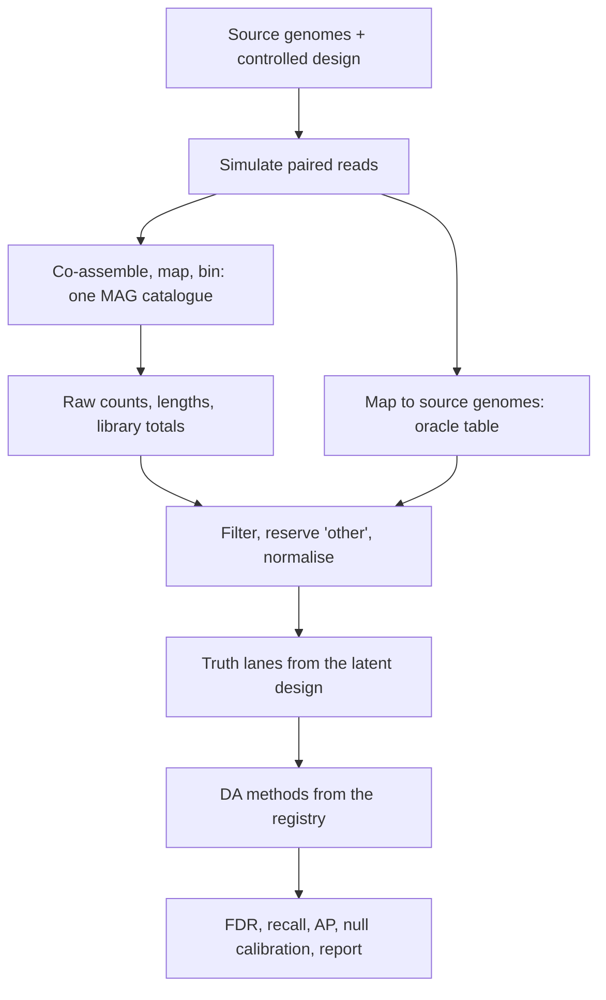

# MAGICIAN: differential abundance benchmarks on MAGs

**Current experiment:** two earlier Tier 1 runs (original and `tier1-v2`) were stopped
after generator and scoring defects were confirmed, and their outputs were deleted.
The operative `tier1-v3` protocol, validation and rerun procedure are recorded in
[docs/corrected_tier1.md](docs/corrected_tier1.md).
The pilot numbers below are historical exploratory results from the original
implementation; they should not be used to establish method reliability.

MAGICIAN tests whether differential abundance (DA) methods stay trustworthy when the
feature table comes from **metagenome-assembled genomes (MAGs)** instead of a clean
taxon table. It simulates communities with a known design, rebuilds a MAG catalogue,
runs 16 DA methods, and scores them against truth defined on the scale each method
actually tests.

## How it works



- **Truth lanes.** Each method is scored on its own endpoint: relative abundance, read
  fraction, CLR, change relative to a typical feature (reference-relative), or absolute
  abundance. A correct read-fraction association is not counted as a false positive.
- **Methods** live in [config/methods.yaml](config/methods.yaml) and run through small
  R adapters in `workflow/scripts/da/`. Variants (e.g. gamma settings) are grouped
  as one method family.
- **No silent wins.** Failed, empty or timed-out methods are recorded and cannot rank.
  A method with zero recall cannot win by declaring nothing.
- **Matrix-only mode** skips reads, assembly and binning, so many replicates are cheap.
- Sequencing intermediates are deleted after counting; only compact matrices and
  audit evidence are kept ([storage policy](docs/storage.md)).

## How to run

```bash
conda env create -n magician --file environment.yaml
conda activate magician
python tools/bootstrap_envs.py --all          # build and freeze method environments (needs network once)
pytest -q                                     # 46 regression tests
python run_magician.py --dry-run              # check the workflow
python run_magician.py --cores 4              # 4-genome smoke test
```

| Goal | Command |
|---|---|
| 20-genome end-to-end pilot | `python run_magician.py --configfile config/pilot20.yaml --cores 8` |
| Matrix-only screening | `python tools/matrix_screening.py --designs baseline overdispersed low_count dropout --null-replicates 5 --spiked-replicates 5` then `python run_magician.py --configfile cache/calibration/config.yaml --cores 8` |
| Real genomes | `python tools/real_genomes.py check\|freeze ...`, then an overlay config ([production.yaml](config/production.yaml) is an example) |
| Cluster | `profiles/slurm` (needs the Snakemake SLURM plugin and your account settings) |

Results go to `results_*/benchmark/`; open `report.html` first. Key tables:
`ranking.tsv` (eligibility and rank), `scores.tsv` (per run), `recovery.tsv`
(source genomes recovered), `method_resources.tsv` (runtime, memory),
`recommendations.json`.

## Pilot benchmark results

Three runs, all on **simulated** data, at alpha 0.05:

| Run | Scale | Outcome |
|---|---|---|
| Calibration | 40 matrix replicates (20 null, 20 spiked) over 4 designs, 16 methods | 964/964 jobs, no failures |
| Screening | 8 replicates, 2 designs | 100/100 jobs |
| Pilot20 | 20 genomes, 10 samples per group, full pipeline, 1 null + 1 spiked | 195/195 jobs |

Calibration, source-level results (FDR on spiked cases, recall, null any-false-discovery rate):

| Endpoint | Method | FDR | Recall | Null any-FD | Eligible |
|---|---|---|---|---|---|
| CLR | ZicoSeq | 0.024 | 0.50 | 0.05 | yes |
| CLR | Wilcoxon-CLR | 0.028 | 0.50 | 0.00 | yes |
| CLR | ALDEx2 / ALDEx3 (gamma 0) | 0.004 | 0.50 | 0.00 | yes |
| CLR | MaAsLin2 | 0.037 | 0.50 | 0.00 | yes |
| CLR | ALDEx2 / ALDEx3 (gamma 0.5) | 0.00 | 0.00 / 0.14 | 0.00 | yes, but near-zero recall |
| CLR | LinDA | 0.028 | 0.50 | 0.10 | no |
| Read fraction | limma-voom | 0.029 | 0.50 | 0.05 | yes |
| Read fraction | DESeq2 | 0.288 | 0.52 | 0.40 | no |
| Read fraction | edgeR | 0.074 | 0.50 | 0.10 | no |
| Reference-relative | radEmu, ADAPT | 0.023, 0.033 | 0.50 | 0.00, 0.05 | yes |
| Reference-relative | MaAsLin3 corrected | 0.014 | 0.50 | 0.15 | no |
| Relative abundance | ANCOM-BC2 | 0.002 | 0.49 | 0.00 | yes |
| Relative abundance | MaAsLin3 abundance | 0.026 | 0.50 | 0.15 | no |

Pilot20 (one replicate per scenario) showed the same pattern: DESeq2 FDR 0.20, edgeR
0.25, everything else 0.00.

## Analysis and verdict

**What the results say**
- On these simulations the CLR family (Wilcoxon-CLR, MaAsLin2, ALDEx2/3 at gamma 0,
  ZicoSeq) keeps FDR at or below about 0.04, and limma-voom is the only count-based
  method that is both calibrated and sensitive.
- DESeq2 and edgeR are anti-conservative: DESeq2 has a spiked FDR of 0.29 and a 0.40
  null false-discovery rate, edgeR 0.10. LinDA and the MaAsLin3 variants fail the
  null check (0.10-0.15).
- Scale assumptions matter. ALDEx2/3 with gamma 0.5 declares almost nothing (recall
  0.00-0.14); at gamma 0 recall is 0.50. Rankings change with this choice.
- Recall tops out at about 0.50 for almost every method, so what separates methods is
  error control, not power.

**Verdict.** The pipeline works end to end and its scoring behaves as designed (failures
and empty results stay visible, nothing wins by abstaining). The method findings are
**smoke-level evidence only** and are labelled `smoke_only` in the output.
- Only 20 null replicates were run, so the 5% error control is not established; the
  exact binomial null intervals are wide. About 100 per design are needed.
- All data are Dirichlet-multinomial matrices or artificial genomes. No real reads or
  genomes have been tested.
- Whether DESeq2/edgeR failures are real or a truth-definition mismatch still has to
  be checked across all truth lanes.
- LOCOM is excluded: its pinned package fails on its own example data.

Practical reading for now: limma-voom and the CLR methods look sound, DESeq2 and edgeR
look anti-conservative on these designs, and no overall winner should be claimed. The
study that turns this into a publishable comparison, with real genomes, real-data
nulls, read-level implants and cohort replication, is specified in [plan.md](plan.md).

## Repository layout

```text
config/            Settings, method registry, zero policies, manifest examples
workflow/          Snakefile, rules, schemas, R/Python adapters, pinned environments
src/magician/      Testable scientific logic
profiles/          Local, SLURM and testing profiles
tools/             Environment bootstrap, matrix screening, genome manifests
tests/             Regression tests and R adapter validation
docs/              Methods, storage, validation record, extension plan
plan.md            Experiment plan for the paper
```

Further reading: [validation record](docs/validation.md), [methods](docs/methods.md),
[extension plan](docs/extension_plan.md).
